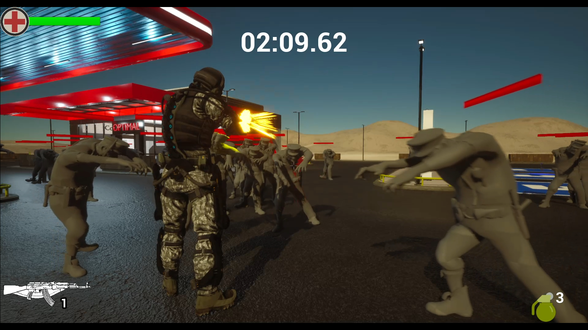
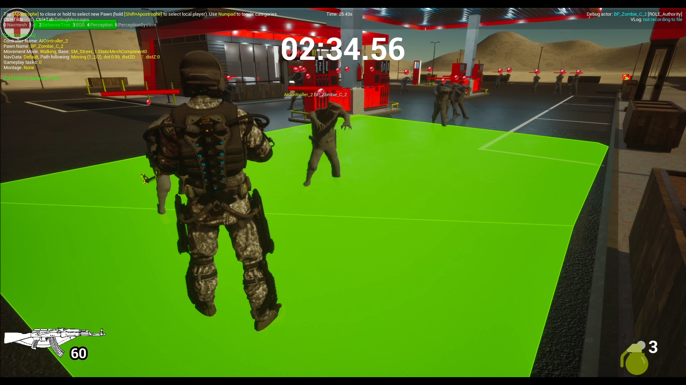

# ZombieShooterCpp

Zombie shooter developed with Unreal Engine 5 and C++.

The project was originally implemented using Blueprints.
I independently rewrote the project in C++, redesigning and implementing
the gameplay logic using Unreal Engine C++ API.

## Features

- Player movement and input using Enhanced Input
- Weapon and shooting system
- Zombie AI and navigation
- Interaction and item pickup system
- Health and damage system
- UI implemented with UMG and C++
- Niagara visual effects
- Communication between gameplay systems using C++ Interfaces and Delegates

## Controls

W / A / S / D - Move
Shift - Sprint
G - Throw grenade

## Technologies

- C++
- Unreal Engine 5
- Unreal Engine C++ API
- Enhanced Input
- AI Module
- Navigation System
- UMG
- Niagara
- Git

## Project Highlights

- 2500+ lines of C++ code
- Gameplay logic fully rewritten from Blueprints to C++
- C++ Interfaces and Delegates for communication between systems
- AI implemented using Unreal Engine AI and Navigation systems
- UI logic implemented in C++

## Screenshots

Niagara VFX - weapon and hit effects

UI widgets are implemented using UMG with gameplay logic written in C++.

AI and Navigation systems

## Gameplay

Gameplay Demo
https://github.com/user-attachments/assets/ffd1e7c7-9586-4e5a-8dc7-eb043c4a4e55

Full Gameplay
https://github.com/user-attachments/assets/c0d37c76-84aa-4f1b-9377-ee782c3f94d6

Victory Screen
https://github.com/user-attachments/assets/8eb8afd1-1c30-4f6a-be88-7109a4566876